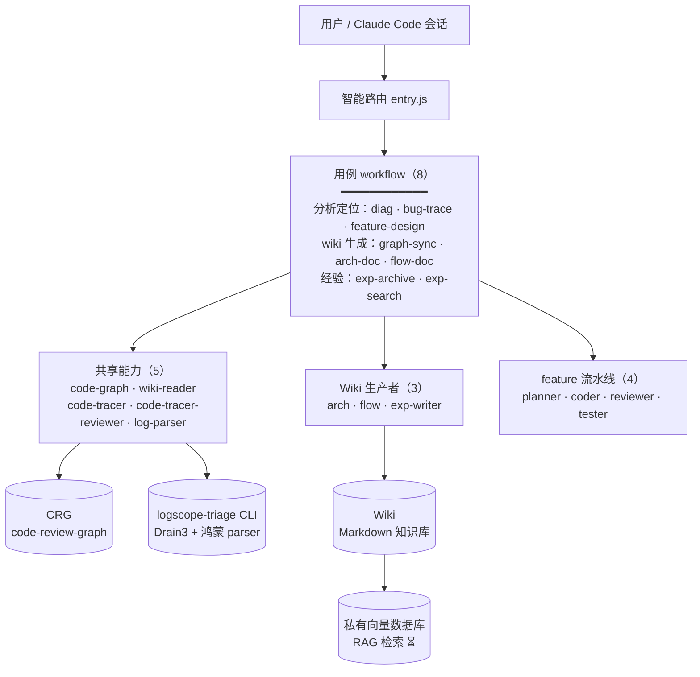

# HiAgent

> CodeAgent 用户请切换到 `codeagent` 分支查看说明。

> 基于 Claude Code 的解耦版 agent 工具集。按**能力层 + 用例编排层**组织——共享能力抽成 subagent，用例 workflow 纯编排。



## 核心能力

**1. 日志定位——丢日志进去，出代码行**

把客户日志丢进来，自动压缩提关键信号，沿代码调用图反向回溯，定位到**具体哪一行代码**有问题，附证据链（日志行号 + `文件:行` + 调用链）。鸿蒙日志（hilog / HiSysEvent / 崩溃栈）开箱即用；长日志不爆上下文（先压成有界摘要，只回读关键行段）。定位给的是根因，不是转发症状。

**2. 经验沉淀——解决过的 case 存下来，下次一查就命中**

每次定位 / 解决完，一键归档成经验页（问题 / 根因 / 证据 / 修复），自动建索引。下次遇到类似问题，查一下就命中旧经验——新人也能直接查到老 case，不靠"问老人"。后续接私有向量数据库（向量 RAG 检索），从"关键词查"升级到"语义查"。

## 为什么用 workflow 编排（相比 agent / skill）

Claude Code 的 workflow 把编排逻辑写成 JS 脚本后台跑，相比用 agent 或 skill turn-by-turn 安排工作流：

- **中间结果留脚本变量，不进会话上下文**——长任务（多步回溯、批量生成 wiki）不撑爆会话，会话只收最终结果
- **编排代码化，确定可复现**——循环 / 分支 / 扇出写在 JS 里，不是靠 LLM 即兴决定；同一输入跑出同一编排路径
- **后台跑，会话保持响应**——不用等整个长任务跑完才能继续问别的
- **结构化输出校验**——`agent(prompt, {schema})` 校验 + 重试，下游 phase 拿到的数据形状可靠，不用 fragile 正则解析
- **并行 / 流水线原语**——`parallel()` / `pipeline()` 扇出，比 turn-by-turn 顺序快

## 解决的痛点

1. 学习门槛高 → `entry` 路由按意图自动分发，不用记每个用法
2. 能力重复 → code-tracer / wiki-reader / code-graph 跨用例复用，不复制
3. 经验不沉淀 → exp-writer 归档 + wiki-reader 检索

## 两层架构

```
第 1 层：共享能力（跨 workflow 复用）
  code-graph · wiki-reader · code-tracer · log-parser

第 2 层：专职 subagent（各被特定 workflow 调）
  Wiki 生产者：arch-writer · flow-writer · exp-writer
  feature 流水线：feature-planner · feature-coder · feature-reviewer · feature-tester
```

用例 workflow（9 个）纯编排第 1/2 层能力，不含可复用逻辑。

## 结构

```
HiAgent/
├── .claude/
│   ├── agents/            # 11 subagent（4 共享 + 3 wiki 生产者 + 4 feature 流水线）
│   ├── workflows/         # 9 workflow（entry + 8 用例）
│   └── settings.json      # 权限 + CRG MCP
├── tools/
│   ├── src/logscope_triage/  # logscope-triage CLI 源（Drain3 + 鸿蒙 parser）
│   ├── test/                 # 单元测试 + 样本
│   └── pyproject.toml
├── CLAUDE.md
└── README.md
```

## 前置条件

- **Claude Code** ≥ v2.1.154（workflows 支持）
- **uv** + **code-review-graph**（CRG）
- **logscope-triage** CLI（装自 `tools/`）

## 安装

### Linux / macOS

```bash
# 1. 拿到本仓
git clone https://github.com/astronautJack/HiAgent.git HiAgent && cd HiAgent

# 2. 装 uv（CRG + logscope-triage 用）
curl -LsSf https://astral.sh/install.sh | sh

# 3. 装 CRG（代码图）
uv tool install code-review-graph

# 4. 装 logscope-triage CLI（本仓 Python CLI）
cd tools && uv tool install . && cd ..

# 5. 确保 ~/.local/bin 在 PATH（uv 安装器通常已加）
export PATH="$HOME/.local/bin:$PATH"   # 永久：写进 ~/.bashrc

# 6. 验证
code-review-graph --version            # 应出版本号
logscope-triage --help                 # 应有 --json / --log-format

# 7. 启动 Claude Code（加载 .claude/ + CLAUDE.md）
claude
```

### Windows（PowerShell）

```powershell
# 1. 拿到本仓
git clone https://github.com/astronautJack/HiAgent.git HiAgent; cd HiAgent

# 2. 装 uv（CRG + logscope-triage 用）
irm https://astral.sh/install.ps1 | iex

# 3. 装 CRG（代码图）
uv tool install code-review-graph

# 4. 装 logscope-triage CLI（本仓 Python CLI）
cd tools; uv tool install .; cd ..

# 5. 确保 ~/.local/bin 在 PATH（uv 安装器通常已加；没加则手动加）
$env:Path += ";$HOME\.local\bin"   # 当前会话；永久：系统环境变量里加 %USERPROFILE%\.local\bin

# 6. 验证
code-review-graph --version            # 应出版本号
logscope-triage --help                 # 应有 --json / --log-format

# 7. 启动 Claude Code（加载 .claude/ + CLAUDE.md）
claude
```

装完重启 Claude Code 让 `settings.json` 的 CRG MCP 生效。改完 `.claude/` 或 `settings.json` 后也要重启。

## 使用说明

### 自动路由（推荐）

```
你：定位这个日志报错到代码行，日志 /path/to/log，代码仓 /path/to/repo
→ entry 分类 → 启动 diag workflow → 返回报告交你审
```

### 手动选 workflow

| 场景 | workflow |
|---|---|
| 日志报错定位 | `diag` |
| bug 报告定位（非日志） | `bug-trace` |
| 需求→设计 | `feature-design` |
| 生成结构 wiki | `graph-sync` |
| 生成架构文档 | `arch-doc` |
| 生成业务流 wiki | `flow-doc` |
| 归档案例 | `exp-archive` |
| 检索历史经验 | `exp-search` |
