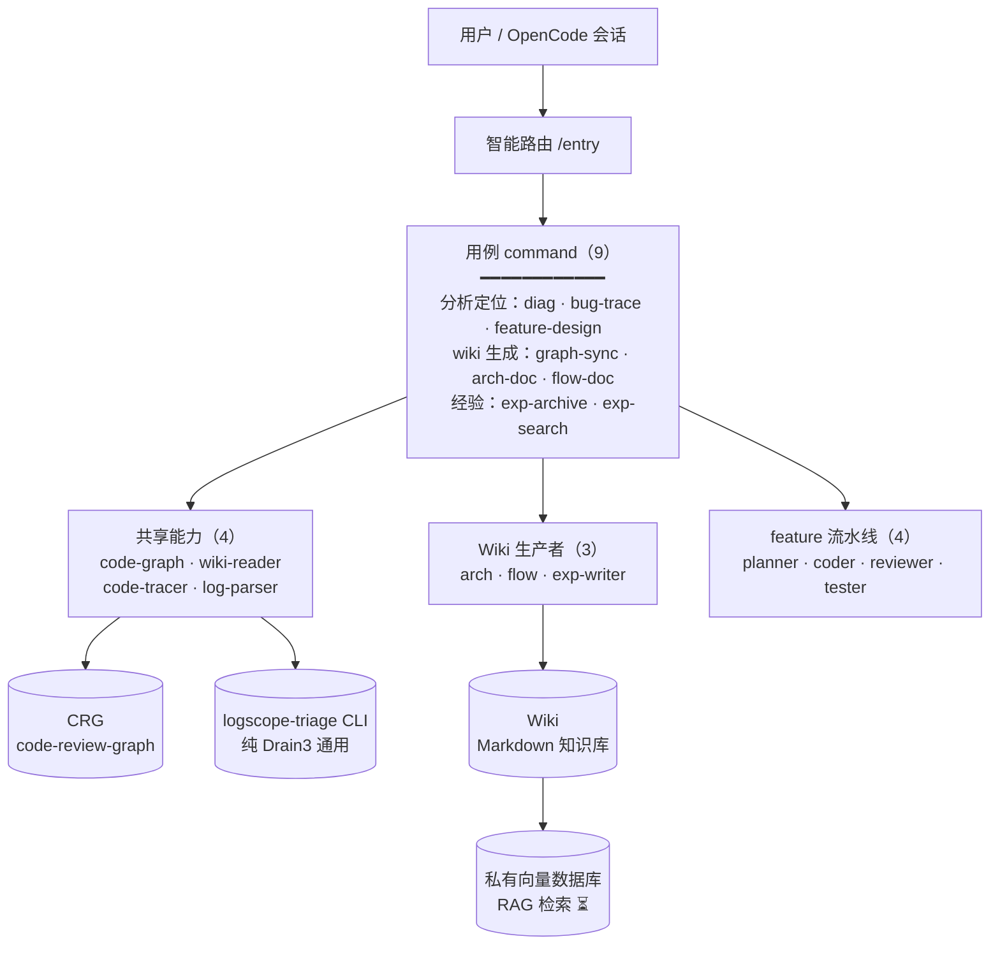

# HiAgent

> 基于 OpenCode 的解耦版 agent 工具集。按**能力层 + 用例编排层**组织——共享能力抽成 subagent，用例 command 纯编排（turn-by-turn 串 subagent）。



## 核心能力

**1. 日志定位——丢日志进去，出代码行**

把客户日志丢进来，自动压缩提关键信号（Drain3 模板挖掘 + 新见簇检测），沿代码调用图反向回溯，定位到**具体哪一行代码**有问题，附证据链（日志行号 + `文件:行` + 调用链）。任意格式日志（logcat / 通用文本日志）开箱即用；长日志不爆上下文（先压成有界摘要，只回读关键行段）。定位给的是根因，不是转发症状。

**2. 经验沉淀——解决过的 case 存下来，下次一查就命中**

每次定位 / 解决完，一键归档成经验页（问题 / 根因 / 证据 / 修复），自动建索引。下次遇到类似问题，查一下就命中旧经验——新人也能直接查到老 case，不靠"问老人"。后续接私有向量数据库（向量 RAG 检索），从"关键词查"升级到"语义查"。

## 为什么用 command 编排

OpenCode 用 `.opencode/commands/*.md` 提示模板编排，跑时按步骤调 Task 串 subagent：

- **编排步骤化，确定可复现**——多步回溯 / 批量生成 wiki 写成 command 的有序步骤，不靠 LLM 即兴决定
- **`subtask:true` 隔离**——复杂编排（diag/bug-trace）在子会话跑，中间结果不进主上下文，主会话只收最终报告
- **单 agent 委派直连**——单步用例（graph-sync/flow-doc 等）用 `agent:<name>` 直接调该 subagent，无编排层开销
- **可中途问用户**——OpenCode 有 question 工具，CRG 新鲜度门可内联进 command 问用户（不像 Claude Code workflow 不能中途暂停）
- **原生 OpenCode 生态**——和 DCP 插件、@ 提及 subagent、原生 whenToUse 一致

## 解决的痛点

1. 学习门槛高 → `/entry` 路由按意图自动分发，不用记每个用法
2. 能力重复 → code-tracer / wiki-reader / code-graph 跨用例复用，不复制
3. 经验不沉淀 → exp-writer 归档 + wiki-reader 检索

## 两层架构

```
第 1 层：共享能力（跨 command 复用）
  code-graph · wiki-reader · code-tracer · log-parser

第 2 层：专职 subagent（各被特定 command 调）
  Wiki 生产者：arch-writer · flow-writer · exp-writer
  feature 流水线：feature-planner · feature-coder · feature-reviewer · feature-tester
```

用例 command（9 个）纯编排第 1/2 层能力，不含可复用逻辑。

## 结构

```
HiAgent/
├── .opencode/
│   ├── agents/            # 11 subagent（4 共享 + 3 wiki 生产者 + 4 feature 流水线）
│   ├── commands/          # 9 命令（entry + 8 用例）
│   └── ...
├── opencode.json          # 权限 + CRG MCP（根目录）
├── AGENTS.md              # agent-facing 指令（两层架构 + command 表 + wiki 约定 + 新鲜度门）
├── tools/
│   ├── src/logscope_triage/  # logscope-triage CLI 源（纯 Drain3 通用）
│   ├── test/                 # 单元测试 + 样本
│   └── pyproject.toml
├── AGENTS.md
└── README.md
```

## 前置条件

- **OpenCode**（`opencode` 命令；建议较新版本支持 `subtask`/`permission` 字段）
- **uv** + **code-review-graph**（CRG）
- **logscope-triage** CLI（装自 `tools/`）

## 安装

### Linux / macOS

```bash
# 1. 拿到本仓（只 clone opencode 分支）
git clone -b opencode https://github.com/astronautJack/HiAgent.git HiAgent && cd HiAgent

# 2. 装 uv（CRG + logscope-triage 用）
curl -LsSf https://astral.sh/install.sh | sh

# 3. 装 CRG（代码图）
uv tool install code-review-graph

# 4. 装 logscope-triage CLI（本仓 Python CLI）
cd tools && uv tool install . && cd ..

# 5. 确保 ~/.local/bin 在 PATH（uv 安装器通常已加）
export PATH="$HOME/.local/bin:$PATH"   # 永久：写进 ~/.bashrc

# 6. 验证
code-review-graph --version            # 应出版本号
logscope-triage --help                 # 应有 --json

# 7. 启动 OpenCode（加载 .opencode/ + opencode.json + AGENTS.md）
opencode
```

### Windows（PowerShell）

```powershell
# 1. 拿到本仓（只 clone opencode 分支）
git clone -b opencode https://github.com/astronautJack/HiAgent.git HiAgent; cd HiAgent

# 2. 装 uv（CRG + logscope-triage 用）
irm https://astral.sh/install.ps1 | iex

# 3. 装 CRG（代码图）
uv tool install code-review-graph

# 4. 装 logscope-triage CLI（本仓 Python CLI）
cd tools; uv tool install .; cd ..

# 5. 确保 ~/.local/bin 在 PATH（uv 安装器通常已加；没加则手动加）
$env:Path += ";$HOME\.local\bin"   # 当前会话；永久：系统环境变量里加 %USERPROFILE%\.local\bin

# 6. 验证
code-review-graph --version            # 应出版本号
logscope-triage --help                 # 应有 --json

# 7. 启动 OpenCode（加载 .opencode/ + opencode.json + AGENTS.md）
opencode
```

装完重启 OpenCode 让 `opencode.json` 的 CRG MCP 生效。改完 `.opencode/` 或 `opencode.json` 后也要重启。

## 使用说明

### 自动路由（推荐）

```
你：/entry 定位这个日志报错到代码行，日志 /path/to/log，代码仓 /path/to/repo
→ /entry 分类意图 → 建议跑 /diag → /diag 子会话编排 → 返回报告交你审
```

### 手动选命令

| 场景 | 命令 |
|---|---|
| 日志报错定位 | `/diag` |
| bug 报告定位（非日志） | `/bug-trace` |
| 需求→设计 | `/feature-design` |
| 生成结构 wiki | `/graph-sync` |
| 生成架构文档 | `/arch-doc` |
| 生成业务流 wiki | `/flow-doc` |
| 归档案例 | `/exp-archive` |
| 检索历史经验 | `/exp-search` |
| 模糊意图路由 | `/entry` |

也可直接 `@<agent名>` 手动调单 subagent（如 `@code-tracer`）。
