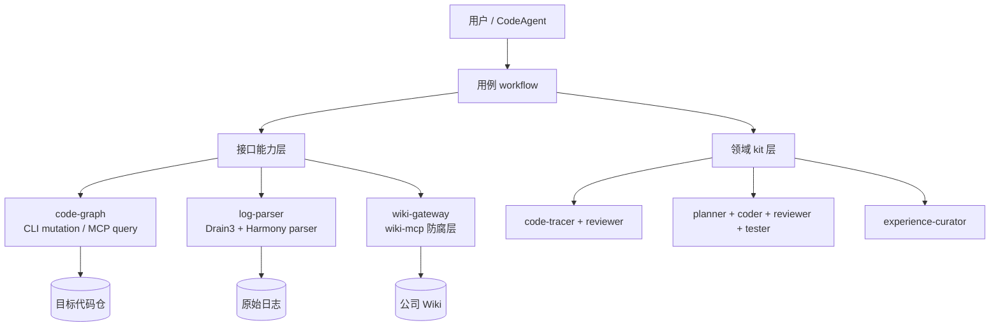

# HiAgent

HiAgent 是面向公司 Windows CodeAgent 环境的工程工作流套件，集中解决三件事：

1. **日志定位**：长日志先由 Drain3 压成有界结构，再沿 CRG 调用图定位根因代码行，并由独立 reviewer 复核。
2. **代码生成**：先设计、人工批准，再执行 coder → CRG 增量刷新 → reviewer → tester 闭环；不自动提交或推送。
3. **经验沉淀**：只有人工确认且验证充分的结果，才通过公司 `wiki-mcp` 幂等写入；检索范围和权限由 MCP 自动处理。

本项目只支持 **Windows**，运行时目录为 `.cac/`，启动命令为 `codeagent`。

## 架构



workflow 只做状态机与结构化数据传递；subagent 负责底层能力和领域判断。wiki-mcp 的具体工具名只允许 `wiki-gateway` 知道。

## Windows 安装

前提：Git for Windows、CodeAgent，以及通过公司 `uv_install.psl` 安装好的 `uv`。

```powershell
git clone -b codeagent https://github.com/astronautJack/HiAgent.git
cd HiAgent
.\scripts\install.ps1
.\scripts\configure-wiki.ps1
codeagent
```

安装脚本只使用 `uv tool install` 下载并安装：

- `code-review-graph`
- 本仓的 `logscope-triage` 与 `hiagent-crg`

脚本不会下载 uv，也不配置 wiki token。公司 CodeAgent 会话应自动注入准确命名的 `wiki-mcp`。

`configure-wiki.ps1` 要求填写 `base_url` 和当前配置中各分类的准确名称。gateway 让 wiki-mcp 从 base 导航到对应子位置，不拼接 URL。分类列表和来源路由完全在 `.cac/wiki-targets.json` 中配置，后续增删、改名或合并分类不需要改 workflow。任何页面都禁止直接写入 base。

进入内网后的第一条 CodeAgent 命令：

```text
运行 wiki-health
```

`ready=true` 表示检索、读取、写入能力均可用。探测是只读的，不创建测试页面。

## 使用

### 日志定位

```text
定位日志 C:\logs\player.log，代码仓 C:\src\player，格式 auto
```

对应 `diag`。首次默认使用 Drain3 `learn` 模式，按仓库积累模板；已有健康基线后可指定 `drainMode=inference`，将未命中模板突出为新信号。

返回内容包括根因 `file:line`、日志/源码/图证据、影响面、修复建议、独立审阅结果和报告路径。人工确认并完成验证后再运行 `exp-archive`。

### 代码生成

```text
为 C:\src\player 设计“增加播放超时重试”
```

先运行 `feature-design`。审阅返回的 `hiagent.feature-design.v1` 后，再明确批准并运行 `feature-implement`。实现过程最多三轮，只有 reviewer 与 tester 都通过才返回 `implemented=true`。

### 经验检索与归档

```text
搜索历史上 START_FAIL 是怎么处理的
```

`exp-search` 会在当前用户有权限的 Wiki 范围内做有界检索。历史页面只作为候选，使用前必须与当前源码复核。

归档必须同时满足：人工确认、高置信度、源码证据、验证证据、当前 commit 可获取。写入使用稳定 `external_id`，重复运行会更新同一页；回读核验失败时不会声称归档成功。

## 大仓 CRG

HiAgent **不会通过 MCP 建图**。所有 build、update、postprocess 都由本地 CLI 完成，MCP 仅保留短时只读查询工具。

- 图不存在：小仓同步 build。
- 超过 5000 个 tracked files：首次 build 转为 Windows 后台进程，避免 CodeAgent/MCP RPC 超时中断。
- 图过时或工作区有改动：使用增量 update。
- 后台状态和日志：`<repo>\.hiagent\crg-state.json`、`crg-build.log`。

若 workflow 返回 `state=building`，无需重配；建图完成后原样重试即可。阈值和前台超时可用 `HIAGENT_CRG_LARGE_THRESHOLD`、`HIAGENT_CRG_TIMEOUT` 调整。

大型仓库建议添加 `.code-review-graphignore`，排除已被 git 跟踪但不应进入图的生成物、vendor 和大型快照。

## Workflow

| workflow | 作用 | 人工边界 |
|---|---|---|
| `entry` | 模糊请求分类与分发 | 低置信时返回澄清问题 |
| `wiki-health` | 只读探测 wiki-mcp | 无 |
| `diag` | 日志 → 根因报告 → 独立复核 | 修复、归档前人审 |
| `bug-trace` | 非日志 BUG → 根因报告 → 独立复核 | 修复、归档前人审 |
| `feature-design` | 需求 → 结构化设计 | 必须审批 |
| `feature-implement` | 已批准设计 → 实现/审查/测试 | 用户手动提交 |
| `exp-search` | 权限内历史经验检索 | 当前源码复核 |
| `exp-archive` | 质量门 → wiki-mcp 幂等写入 | 必须确认且有验证证据 |

## 验证

```powershell
.\scripts\test.ps1
```

测试包括 workflow 状态机、日志契约、Harmony/Windows 路径解析、Drain3 masking、本次运行计数以及 CRG 大仓后台门禁。

进一步说明见 [Windows 内网手工适配](docs/internal-adaptation-windows.md)、[架构](docs/architecture.md)、[数据契约](docs/contracts.md) 和 [CRG/Drain3 设计](docs/crg-drain3.md)。
