# HiAgent

> 基于 Claude Code 的解耦版 agent 工具集。按**能力层 + 用例编排层**组织——共享能力抽成 subagent，用例 workflow 纯编排。

## 解决的痛点

1. 学习门槛高 → `entry` 路由按意图自动分发
2. 能力重复 → code-tracer / wiki-reader / code-graph 跨用例复用，不复制
3. 经验不沉淀 → exp-wiki-writer 归档 + wiki-reader 检索

## 两层架构

```
第 1 层：共享能力（跨 workflow 复用）
  code-graph · wiki-reader · code-tracer · log-parser

第 2 层：专职 subagent（各被特定 workflow 调）
  Wiki 生产者：arch-wiki-writer · flow-wiki-writer · exp-wiki-writer
  feature 流水线：feature-planner · feature-coder · feature-reviewer · feature-tester
```

用例 workflow（9 个）纯编排第 1/2 层能力，不含可复用逻辑。

## 结构

```
HiAgent/
├── .claude/
│   ├── agents/            # 11 subagent（4 共享 + 3 wiki 生产者 + 4 feature 流水线）
│   ├── workflows/         # 9 workflow（entry + 8 用例）
│   └── settings.json      # 权限 + CRG MCP
├── tools/
│   ├── src/logscope_triage/  # logscope-triage CLI 源（Drain3 + 鸿蒙 parser）
│   ├── test/                 # 单元测试 + 样本
│   └── pyproject.toml
├── CLAUDE.md
└── README.md
```

## 前置条件

- **Claude Code** ≥ v2.1.154（workflows 支持）
- **uv** + **code-review-graph**（CRG）
- **logscope-triage** CLI（装自 `tools/`）

## 安装

```bash
git clone <本仓地址> HiAgent && cd HiAgent
curl -LsSf https://astral.sh/install.sh | sh
uv tool install code-review-graph
cd tools && uv tool install . && cd ..
export PATH="$HOME/.local/bin:$PATH"
claude
```

## 使用说明

### 自动路由（推荐）

```
你：定位这个日志报错到代码行，日志 /path/to/log，代码仓 /path/to/repo
→ entry 分类 → 启动 diag workflow → 返回报告交你审
```

### 手动选 workflow

| 场景 | workflow |
|---|---|
| 日志报错定位 | `diag` |
| bug 报告定位（非日志） | `bug-trace` |
| 需求→设计 | `feature-design` |
| 生成结构 wiki | `wiki-map` |
| 生成架构文档 | `wiki-doc` |
| 生成业务流 wiki | `wiki-flow` |
| 归档案例 | `exp-archive` |
| 检索历史经验 | `exp-search` |

## 产品结构

```mermaid
flowchart TB
    subgraph UI[用户入口]
        Sess[Claude Code 会话]
        Entry["智能路由 / entry.js"]
    end

    subgraph CAP[第1层 共享能力]
        CG[code-graph]
        WR[wiki-reader]
        CT[code-tracer]
        LP[log-parser]
    end

    subgraph PROD[第2层 Wiki 生产者]
        AW[arch-wiki-writer]
        FW[flow-wiki-writer]
        EW[exp-wiki-writer]
    end

    subgraph FEAT[第2层 feature 流水线]
        FP[feature-planner]
        FC[feature-coder]
        FR[feature-reviewer]
        FT[feature-tester]
    end

    Wiki[Wiki<br/>Markdown 知识库]
    CLI["logscope-triage CLI<br/>Drain3 + 鸿蒙 parser"]
    ATH["雅典娜<br/>向量化原子知识库 RAG<br/>⏳ 后续接入"]

    Sess --> Entry
    Entry --> Diag[diag]
    Entry --> BugT[bug-trace]
    Entry --> FeatD[feature-design]
    Entry --> WMap[wiki-map]
    Entry --> WDoc[wiki-doc]
    Entry --> WFlow[wiki-flow]
    Entry --> ExpA[exp-archive]
    Entry --> ExpS[exp-search]

    Diag --> LP
    Diag --> WR
    Diag --> CT
    BugT --> WR
    BugT --> CT
    FeatD --> FP
    WMap --> CG
    WMap --> AW
    WDoc --> CG
    WDoc --> AW
    WFlow --> FW
    ExpA --> EW
    ExpS --> WR

    AW --> Wiki
    FW --> Wiki
    EW --> Wiki
    LP --> CLI
    Wiki --> ATH
```


