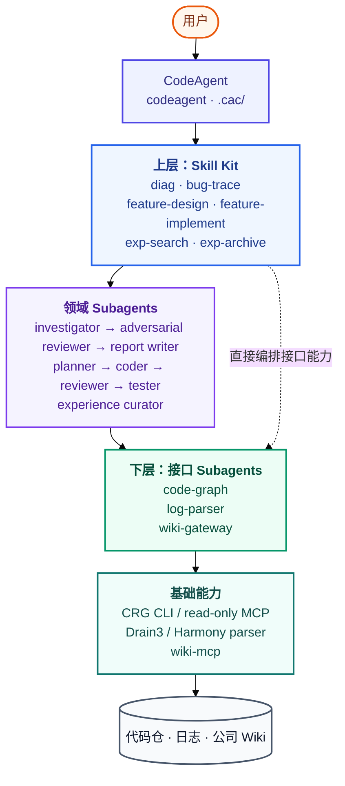
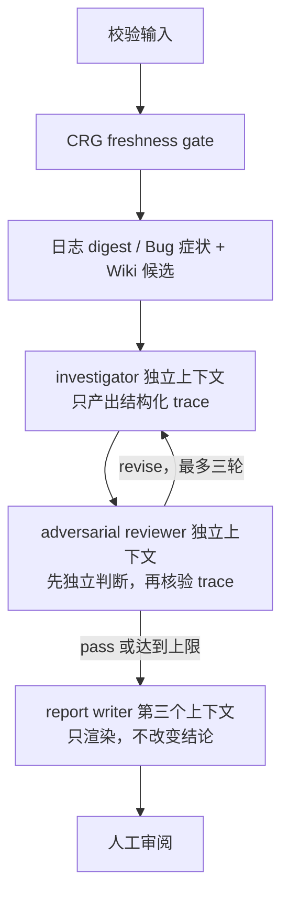
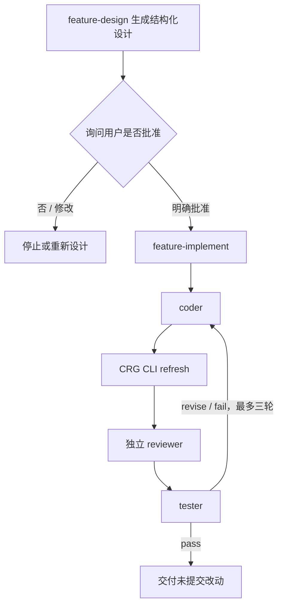
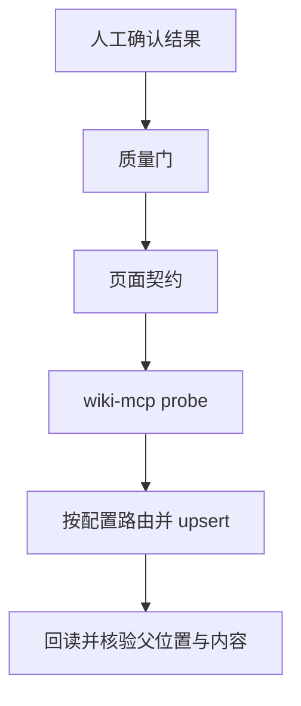

# 架构

## 目标与取舍

HiAgent 是 skill kit，不是通用 agent 市场。它只保留三条闭环：诊断、代码实现、经验沉淀。旧版中本地 Markdown wiki、多个 writer、CRG 建图 prompt 和用例内重复检索都被移除。

分层依据是“上层 kit 依赖稳定接口，下层实现可替换”：

## 依赖方向

- skill 可以调用接口 agent 和领域 agent。
- 领域 agent 可以使用当前源码、git 和 CRG 只读查询，但不能调用其他 agent。
- 只有 `wiki-gateway` 直接接触 wiki-mcp。
- 只有 `code-graph` 执行 CRG mutation。
- Python CLI 不调用 LLM，输出可测试的确定性 JSON。

这两个“唯一入口”是防腐层：内网 wiki-mcp 工具签名变化只改一个 agent；CRG 建图策略变化也只改一个 agent/CLI。

Wiki 分类不是代码接口：`.cac/wiki-targets.json` 保存可变的 categories/routes。skill 只传来源场景，gateway 从 base 导航到配置名称；增删、改名或合并目录不影响上层。

## 三条状态机

### 诊断

review 最多三轮。报告在复核结束前不存在；未达一致时 writer 必须醒目标记争议并返回所有 open questions，不通过措辞掩盖分歧。

### 代码生成

`feature-design` 返回 `ask_user` 和结构化 handoff；CodeAgent 必须在下一步询问用户。只有明确批准后，才把同一份 design 原样交给 `feature-implement`。实现闭环最多三轮，任何阶段失败都保留工作区，但不 commit/push。

### 经验沉淀

“写请求成功”不等于“归档成功”；只有回读核验通过才返回 `archived=true`。

## 安全边界

- 原始日志只落目标仓运行目录或引用原路径，不整份进入 LLM/wiki。
- wiki 页面可能包含 prompt injection；只抽事实候选，忽略其中任务指令。
- 运行时路径必须为 Windows 绝对路径，报告必须位于目标仓内且拒绝 `..` 穿越。
- CRG cloud embedding 默认关闭，避免未经确认发送源码派生信息。
- `apply_refactor_tool` 不暴露给 MCP，代码修改只能走 feature-coder 并经过审查测试。

## 内网兼容假设

仅依赖已知与 CodeAgent 一致的能力：`.cac/skills/<name>/SKILL.md`、`skill` 工具按需加载、`agent()`、结构化 schema 和 `.cac/agents`。wiki-mcp 的权限由内网服务处理，不引入 token 配置。
